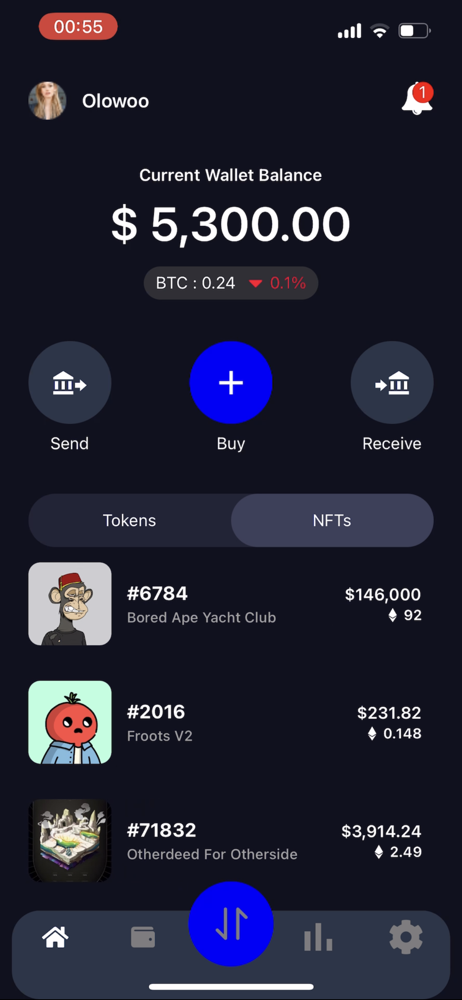
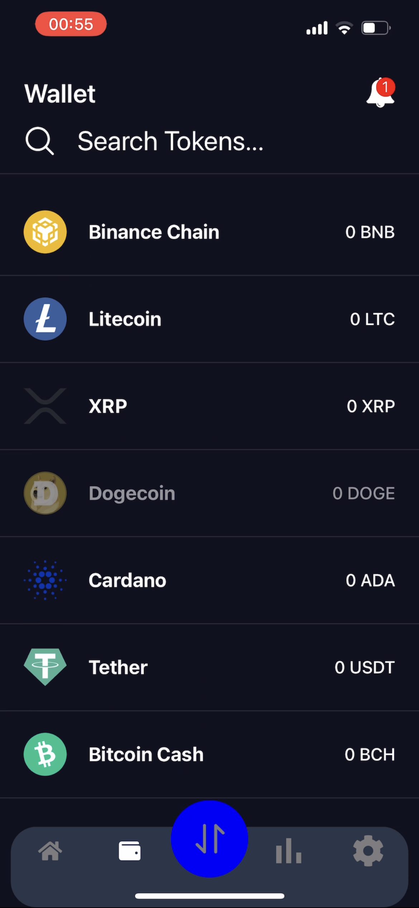
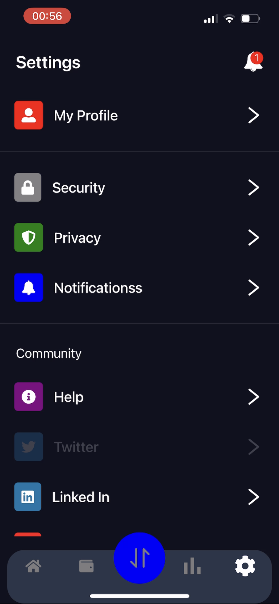

# **NFT Wallet App**

This is a cryptocurrency and nft wallet application.

## Here's the result

https://github.com/Olowodev/car-app/assets/99045599/2660c0d0-0cbc-4463-8ed4-eec9d15a120a

 

## Static shots of the app screens

 

### Features

- It was built to represent a crypto and nft wallet so it has the features of one including;
- Displaying current balance in fiat currency
- Displaying cryptocurrencies being held in the wallet
- Displaying NFts availabe and more.

### Stack used

- React Native
- Expo
- Reanimated library
